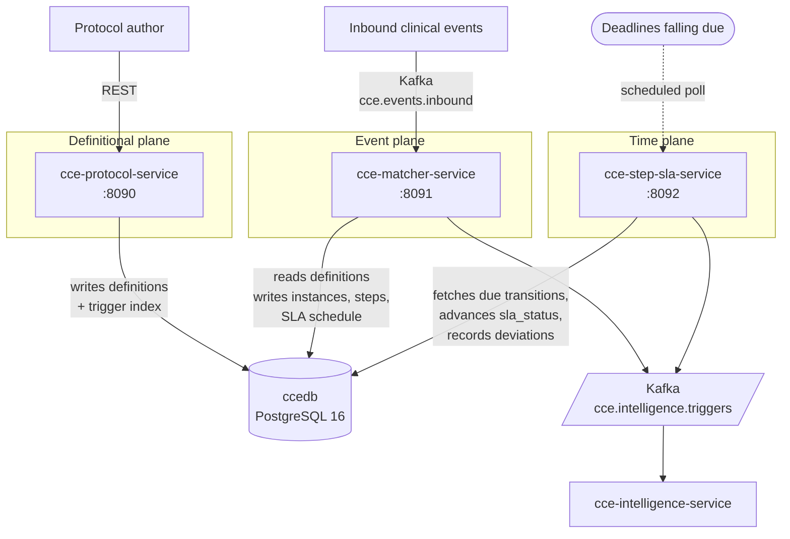
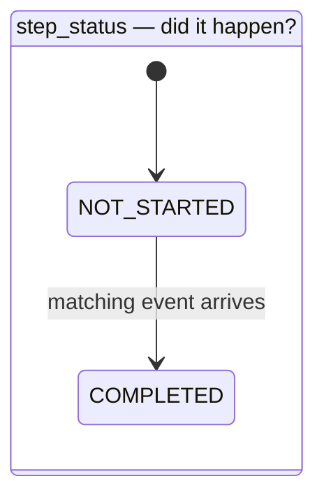
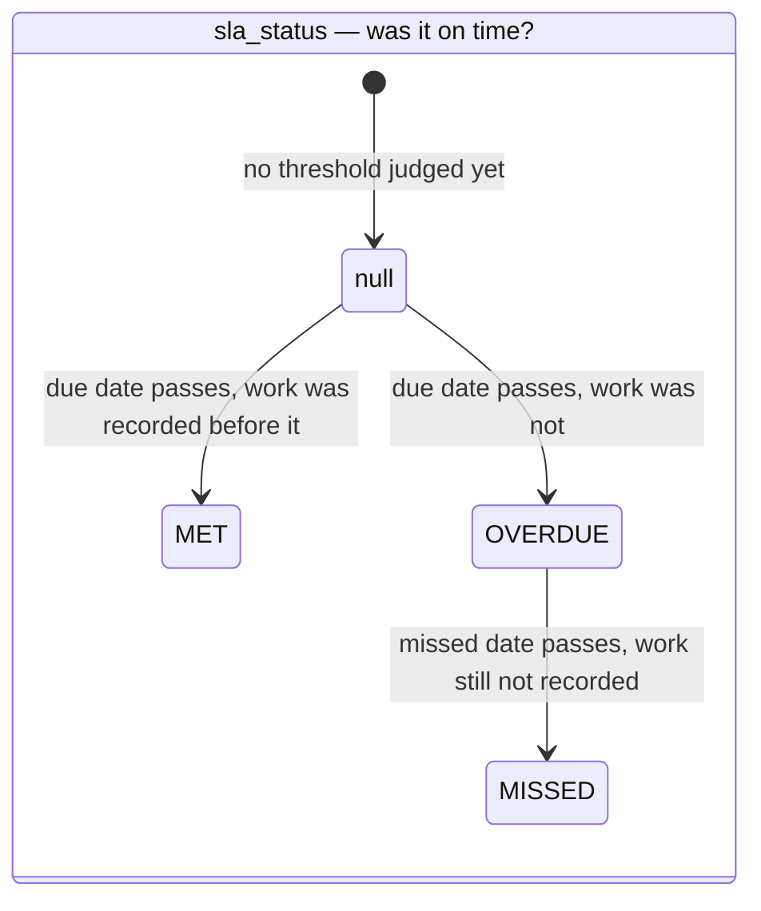

# Architecture Overview — CCE Services

> How the four repositories divide the work, and the contracts that hold between them.

This document is the shared context. Each service repository documents its own internals; none of
them restates what is here.

| Repository | Responsibility |
|---|---|
| **cce-protocol-service** | The definitional plane. Loads FHIR PlanDefinitions and ActivityDefinitions, builds the trigger index. |
| **cce-matcher-service** | The event plane. Matches inbound clinical events, enrols patients, creates and completes steps. |
| **cce-step-sla-service** | The time plane. Applies SLA transitions as deadlines pass, records the resulting deviations. |
| **cce-common-util** | This library. Shared entities, repositories, FHIR parsing, and the services that operate on them. |

---

## 1. Why the split

The three planes have different shapes, and merging them meant every one of them got the wrong
deployment.

**Definitions change rarely and by human action.** A protocol is published, reviewed, retired.
Throughput is measured in loads per month. This plane wants a small, tightly-audited surface with
write access to definitional tables and no clinical traffic.

**Events arrive continuously and unpredictably.** Inbound volume tracks clinic activity, so the
event plane needs to scale horizontally with Kafka partitions and hold no state between records. It
is latency-sensitive: a clinician is often waiting on the other end.

**Time passes at a constant rate.** SLA deadlines fall due whether or not any event arrives, so
this plane is a scheduled sweep over a due-work table. It scales with the *backlog*, not with
inbound traffic, and a burst of clinical events must not delay it — nor it them.

A single deployment had to be sized for the union of all three, and any one of them could stall the
others. Splitting them lets each scale, fail and deploy on its own terms.

### What is deliberately not split

The **database** is shared (`ccedb`) rather than one per service. Splitting it would put a network
hop and an eventual-consistency window between `step_instance` and the `deviation` rows that
reference it, and the reporting queries that join them are the product. Instead the boundary is
enforced by column ownership — see
[Data Dictionary §3](data-dictionary.md#3-ownership).

The **persistence layer** is shared through this library rather than duplicated per service. An
earlier arrangement kept JPA out of common-util on the theory that entities are a service's private
business; the result was ~550 lines of identical entity and repository code in three repos, drifting
independently. A column added in one place and missed in another is a production failure, so the
entities live here once.

---

## 2. Service topology

There is no synchronous call between the three services, and no Kafka hop between them either. They
coordinate entirely through `ccedb`: the Protocol Service writes rows the Matcher Service reads, and
the Matcher Service writes the `step_sla_state_transition` rows the Step SLA Service fetches. This
is deliberate — a request-response dependency between them would mean an inbound clinical event
could fail because the definitional plane was restarting.

---

## 3. The intelligence trigger

Both the Matcher and Step SLA services publish to `cce.intelligence.triggers`, because both can
be the proximate cause of an intelligence action: the Matcher when a step completes or an
`ORDER_VIOLATION` is detected, the Step SLA Service when a deadline passes. The evaluation logic
is identical, so it lives here once
([`IntelligenceActionEvaluator`](library-reference.md#intelligence--intelligenceactionevaluator)) and both
services drive it.

Publication is confirmed rather than fire-and-forget: the producer waits for the broker
acknowledgement and records the outcome on the `intelligence_event_log` row. A trigger the broker
never acknowledged stays marked unpublished and is replayable, rather than being lost while the
clinical work that caused it commits regardless.

---

## 4. Step status and SLA status

Two independent facts about a step, in two columns:

- **`step_status`** — did the expected event arrive? `NOT_STARTED` → `COMPLETED`.
- **`sla_status`** — was the deadline met? *null* → `OVERDUE` → `MISSED`, or *null* → `MET`.

These were once a single `state` column plus a `completion_status`, which could not represent
"completed, but late" without inventing composite states, and forced two services to write the same
column. Splitting them means the pair reads directly: `COMPLETED` + `MISSED` is late work that got
done, `NOT_STARTED` + `MISSED` is work that did not. `completion_status` was dropped because
early-versus-late is derivable from the pair.

`sla_status` has **no initial enum value**. The column is nullable, and null means there is nothing to
judge on yet: no threshold has fallen due, and the step has not been completed either. The former
`PENDING` and `DUE` both said that, and saying it with an enum constant made the absence of a judgement
look like one that had been made. Null is also the permanent state of a step with no due date: no
thresholds are scheduled for it, so nothing will ever judge it, which is exactly right.

Ownership: the Matcher Service writes `step_status` and `completed_at`; the **Step SLA Service alone**
writes `sla_status`. Matcher records that the work happened and when, never whether that was timely —
so there is no rule about which service may overwrite the other, because only one of them ever writes
the column. A step's SLA has exactly one author and one source of evidence. See
[Data Dictionary §3](data-dictionary.md#3-ownership).

Single ownership does not mean a completion waits for its deadline to be judged. `completed_at` fixes
the answer the moment it is recorded, so Matcher schedules the verdict there and then — a
`MET_CONDITION_REACHED` row whose `process_by` is that `completed_at`, already due — and Step SLA
records `MET` on its next cycle rather than at the threshold: seconds later, not weeks. A breach does
still wait for its schedule to come round, because the threshold is what it is measured against. §5 is
how.

What each threshold means for a step is the SLA transition contract, in §5.

---

## 5. SLA transition contract

The Matcher Service knows a step's deadlines the moment it creates the step; the Step SLA Service
must act on them later, without polling every step in the database. The `step_sla_state_transition`
table is that handoff — one row per verdict to be reached, carrying the time it becomes actionable.
Two are written at step creation, one per deadline. The third, `MET_CONDITION_REACHED`, is written at
the completion that earns it, because nothing is known about timeliness before then.

**Matcher inserts. Step SLA fetches.** A row is fetched under `FOR UPDATE SKIP LOCKED`, which is
what lets every Step SLA replica poll the same table concurrently: a row locked by one replica is
invisible to the others rather than contended. There is no lease table, no heartbeat and no leader
election — the row lock *is* what reserves the row, held for the length of the transaction that applies
it. A replica that dies mid-batch releases its locks on connection loss and the work is immediately
available again.

Fetch and apply happen in **one** transaction. Fetching in one and applying in another would leave a
window where a row is marked taken but not yet acted on, which is exactly the state a crash makes
permanent.

**A row is fetched for one reason.** Its `next_attempt_at` has passed — the deadline fell and the work
has to be judged against it. Nothing pulls a step's remaining rows forward because the step completed or
was judged: a step already settled keeps its unspent schedule until those dates arrive, and each row is
consumed then, recording nothing. An on-time completion does not wait either, and needs no scan of
`step_instance` to avoid it: its row is written *at* the completion with a `process_by` already in the
past, so the one gate lets it through on the next cycle.

What the applier does depends on the step it finds, not on when it runs. It compares
`step_instance.completed_at` against the row's `process_by` and never consults the wall clock — and
`next_attempt_at`, the gate that decided the row was ready, plays no part in the judgement at all.
So a row deferred by a failure and applied late reaches exactly the verdict it would have reached on
time:

| Row | Step when applied | `sla_status` | Deviation |
|---|---|---|---|
| `DUE_DATE_REACHED` | not completed | `OVERDUE` | `OVERDUE` |
| `DUE_DATE_REACHED` | `completed_at >= process_by` | `OVERDUE` | `OVERDUE` |
| `DUE_DATE_REACHED` | `completed_at < process_by` | *unchanged* | — |
| `MISSED_DATE_REACHED` | not completed | `MISSED` | `MISSED` |
| `MISSED_DATE_REACHED` | `completed_at >= process_by` | `MISSED` | `MISSED` |
| `MISSED_DATE_REACHED` | `completed_at < process_by` | *unchanged* | — |
| `MET_CONDITION_REACHED` | `completed_at < due_date` | `MET` | — |
| `MET_CONDITION_REACHED` | anything else | *unchanged* | — |

A *deadline* row only ever records a breach, so one whose threshold was kept is consumed. `MET` has a
row of its own, written by Matcher when the completing event lands early rather than scheduled with the
step — nothing is known about timeliness at creation. Note which column each verdict is measured
against: a breach against the row's `process_by`, `MET` against the step's `due_date`. The `MET` row's
`process_by` is the `completed_at` that prompted it, which is what makes it due immediately.

Which is also why a step completed *between* its two thresholds is not `MET`. It breached neither, and
breaching neither is not the same claim as having been on time.
"Did not breach this threshold" and "met its SLA" coincide only at the due date, which is why `MET` is
written on that row alone, and only over a null.

Writes are **forward-only**: `MET` and `MISSED` are settled outcomes, and `OVERDUE` never replaces
`MISSED` — which is what a retry applying two rows out of order would otherwise do.

**Only mandatory steps have deadlines.** A breach is a deadline missed, and nothing is required of an
optional step — so it can be neither `OVERDUE` nor `MISSED`. Matcher writes no
`step_sla_state_transition` row for one (`StepSlaScheduleService.schedule`), and the Protocol Service
rejects a PlanDefinition whose optional action declares `tolerance-days`
(`PlanDefinitionParser.validateOptionalStepDeadlines`). A row for an optional step can therefore only
predate those rules: the applier consumes it, recording no status and no deviation on either path —
never arrived and recorded late alike.

Mandatory is `requiredBehavior == "must"` and nothing else; an absent value states no requirement.
`RequiredBehavior.isMandatory` is the one definition, shared by progressive instantiation, SLA
scheduling and the SLA judgement. `MET` is untouched by this: it is not a breach, and is settled from
the step's own `due_date`.

The applier never writes `step_status`.

A row that fails is retried with exponential backoff (`2^attempts`, capped), not discarded.

### Event Replay

The contract above carries one condition the code cannot enforce, and operators must.

The Step SLA Service concludes that work has not happened by finding no completion on `step_instance`.
That inference is only sound once every event that could have completed the step has been matched. So
while the Matcher Service still has a backlog to work through — events re-published after a fix, a
historical backfill, or a long outage that left its consumer group far behind — **the Step SLA Service
must be stopped.** Left running, it reads not-yet-matched as not-done and records `OVERDUE` or
`MISSED` against steps whose completing event is still in the queue. **Event Replay** is the name for
any such run; use it when coordinating one.

Replaying historical events makes this the default outcome rather than a race. Thresholds are anchored
to clinical time, so a step created from a month-old event is scheduled with `process_by` already in
the past, and its rows are due the moment they are written — long before the completing event, later in
the same backlog, has been matched.

None of it can be walked back. `sla_status` writes are forward-only and `MET` is written only over a
null, so the wrong verdict stands; the deviation is de-duplicated, so it is not reconsidered; and the
intelligence event has already been published, so a clinician has already been alerted.

Waiting costs nothing but latency. The judgement never consults the wall clock, so a row applied days
late reaches exactly the verdict it would have reached on time. The runbook — how to stop the service,
how to tell the Matcher Service is caught up, and what to do if the sequence was missed — is in the
Step SLA Service repo's deployment guide.

---

## 6. Deployment order

**Protocol → Matcher → Step SLA**, following the migration ownership in
[Data Dictionary §3](data-dictionary.md#3-ownership). Matcher's migration declares foreign keys into
tables the Protocol Service creates, and the Step SLA Service validates its JPA mapping at
startup against tables both of the others created — it will fail fast rather than start against a
schema that cannot serve it.

Each service's own deployment steps are in its repository's deployment guide.

Deploy order is not the only sequence that matters. [Event Replay](#event-replay) above is the runtime
one, and unlike this it fails silently rather than fast.

---

## 7. Where to look next

| For | See |
|---|---|
| Column-level schema, enums, JSONB shapes | [Data Dictionary](data-dictionary.md) |
| What this library provides, package by package | [Library Reference](library-reference.md) |
| `relatedAction` direction, status vocabularies, trigger model | [FHIR Conformance](fhir-conformance.md) |
| Building against or contributing to this library | [Developer Setup](developer-setup.md) |
| Matching algorithm, enrolment, step lifecycle | Matcher Service repo |
| Definition loading and trigger index construction | Protocol Service repo |
| SLA sweep internals and tuning | Step SLA Service repo |
