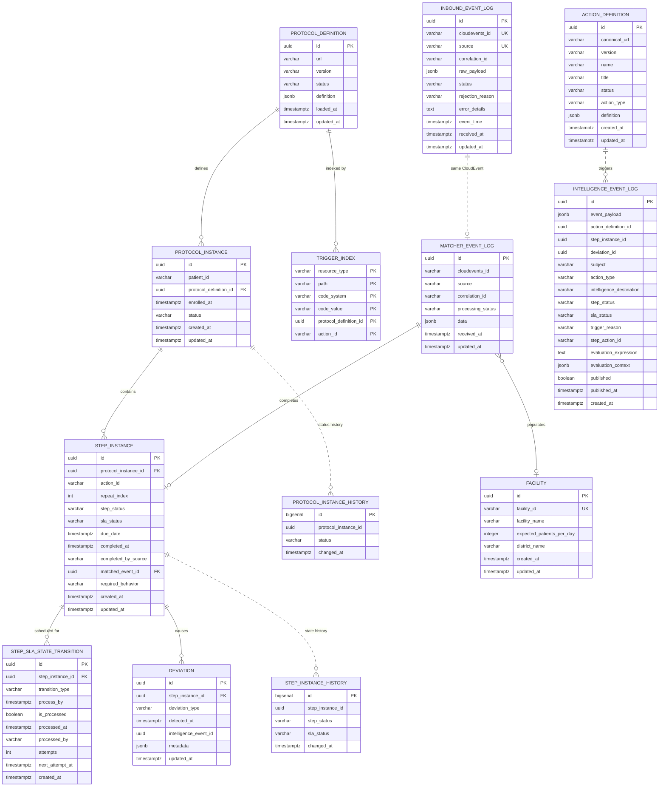

# Data Dictionary — Shared Schema

> **Canonical schema reference for the CCE services.**
> **Database**: PostgreSQL 16 · **Schema**: `public` · **Migrations**: Flyway

The ten tables described **column by column** here are mapped by JPA entities in this library
(`org.openphc.cce.common.entity`), so every service that compiles against it sees the same columns,
types and constraints. That is why the reference lives here rather than in any one service: a column
described in two places eventually disagrees in two places.

Three tables in the same database are mapped elsewhere, so their **columns** are described in the repo
that owns them and not repeated here: `matcher_event_log` and `facility` in the Matcher Service, and
`inbound_event_log` in the Collector Service, which uses this library but maps none of its entities. They still appear
in the ER diagram, the table summary and the ownership table below: a reader asking "what is in `ccedb`
and who writes it" should not have to know which repo an entity happens to live in to get a complete
answer.

The two state-transition history tables *are* documented here, in
[§12](#12-state-transition-history-tables). Their entities moved into this library in 2.0.0 when the
Step SLA Service began recording the `sla_status` transitions it applies, so they stopped belonging
to any one service.

For which service *creates* and which service *writes* each table, see
[§3 Ownership](#3-ownership). For why the boundary falls where it does, see
[Architecture Overview](architecture-overview.md).

---

## Table of Contents

1. [Entity Relationship Diagram](#1-entity-relationship-diagram)
2. [Table Summary](#2-table-summary)
3. [Ownership](#3-ownership)
4. [protocol_definition](#4-protocol_definition)
5. [protocol_instance](#5-protocol_instance)
6. [step_instance](#6-step_instance)
7. [step_sla_state_transition](#7-step_sla_state_transition)
8. [deviation](#8-deviation)
9. [trigger_index](#9-trigger_index)
10. [action_definition](#10-action_definition)
11. [intelligence_event_log](#11-intelligence_event_log)
12. [State-Transition History Tables](#12-state-transition-history-tables)
13. [Enumerated Value Reference](#13-enumerated-value-reference)
14. [Relationships & Foreign Keys](#14-relationships--foreign-keys)
15. [JSONB Column Schemas](#15-jsonb-column-schemas)

---

## 1. Entity Relationship Diagram



> **Note:** See [Architecture Overview §5](architecture-overview.md#5-sla-transition-contract) for how the CCE Step SLA Service fetches and processes `step_sla_state_transition` rows. It needs no lease table — the row lock is what reserves the row.

---


## 2. Table Summary

| # | Table | Purpose | Row Growth |
|---|-------|---------|-----------|
| 1 | `protocol_definition` | FHIR R4 PlanDefinition resources (protocol templates) | Low (tens) |
| 2 | `protocol_instance` | Patient enrolments in specific protocols | Medium (per-patient) |
| 3 | `step_instance` | Individual action steps within a patient's protocol journey | Medium–High |
| 4 | `step_sla_state_transition` | Each step's SLA schedule — one row per threshold | Medium–High |
| 5 | `deviation` | Recorded protocol deviations | Medium |
| 6 | `trigger_index` | Inverted index for fast Tier 1 structural event matching | Low (per protocol load) |
| 7 | `action_definition` | FHIR ActivityDefinition resources for intelligence actions | Low (tens) |
| 8 | `intelligence_event_log` | Intelligence action execution and evaluation context (flat, no FKs) | Medium–High |
| 9 | `protocol_instance_history` | Append-only log of every `protocol_instance.status` transition | High (per status change) |
| 10 | `step_instance_history` | Append-only log of every `step_status` / `sla_status` transition | High (per status change) |
| 11 | `matcher_event_log` † | Lean idempotency log of every inbound CloudEvent and its processing outcome | High (every event) |
| 12 | `facility` † | Reference lookup of known facilities — auto-populated from inbound event payloads | Low (one row per facility) |
| 13 | `inbound_event_log` ‡ | Every CloudEvent the Collector Service accepted or rejected, with its raw payload — the ingestion audit trail and deduplication key | High (every event) |

† Columns documented in the Matcher Service repo
([`matcher_event_log`](../../cce-matcher-service/docs/data-dictionary.md#2-matcher_event_log),
[`facility`](../../cce-matcher-service/docs/data-dictionary.md#3-facility)), which is where their
entities live.

‡ Columns documented in the
[Collector Service repo](../../cce-collector-service/docs/data-dictionary.md#1-database-tables).

Everything else on this page covers rows 1-10.

---

## 3. Ownership

One database, `ccedb`, shared by four services — the three built on this library, plus the Collector
Service, which owns `inbound_event_log`. It uses the library too, but only by importing three beans by
name (`FhirConfig`, `ClinicalEventTimeExtractor`, `KafkaTopicProperties`); it maps none of the entities
here, which is why none of its columns are described on this page. Two rules keep the sharing safe:
exactly one service runs the DDL for a table, and exactly one service writes any given column.

There is no `audit_log`. It was dropped in 2.0.0: the append-only history tables already carry state
transitions, and actor attribution is planned to move onto the domain tables rather than a parallel
log that duplicated half of them without the other half's detail.

| Table | Migration owner | Writers | Readers |
|---|---|---|---|
| `protocol_definition` | Protocol | Protocol | Matcher, Step SLA |
| `action_definition` | Protocol | Protocol | Matcher, Step SLA |
| `trigger_index` | Protocol | Protocol | Matcher |
| `protocol_instance` | Matcher | Matcher | Step SLA |
| `step_instance` | Matcher | Matcher, **Step SLA** (see below) | both |
| `step_sla_state_transition` | Matcher | Matcher (inserts), Step SLA (fetches) | both |
| `deviation` | Matcher | Matcher, Step SLA | both |
| `intelligence_event_log` | Matcher | Matcher, Step SLA | Step SLA |
| `protocol_instance_history` | Matcher | Matcher | — (CDC only) |
| `step_instance_history` | Matcher | Matcher, Step SLA | — (CDC only) |
| `matcher_event_log` | Matcher | Matcher | Matcher |
| `facility` | Matcher | Matcher, programme staff (direct SQL) | Matcher |
| `inbound_event_log` | Collector | Collector | — (CDC only) |

`matcher_event_log` and `facility` are the Matcher Service's alone on every axis — it runs their DDL,
writes them and is the only service that reads them. `matcher_event_log` is its idempotency guard, and
nothing outside it has a reason to consult which events have already been processed. `facility` is the
one table with a writer that is not a service: programme staff set `district_name` and
`expected_patients_per_day` directly in the database, and the Matcher Service never touches those two
columns.

`inbound_event_log` is the Collector Service's, written on the way in and never read back by any
service — the Matcher Service keeps its own record of what it consumed in `matcher_event_log`. The two
hold the same CloudEvent under the same natural key, `(cloudevents_id, source)`, unique in both, which
is what lets an event be traced from the front door to the steps it completed without a foreign key
between them.

The Protocol and Matcher services keep their own Flyway history tables —
`flyway_schema_history_protocol` and `flyway_schema_history_matcher` — so neither ledger sees the
other's migrations. The Step SLA Service creates no tables and runs Flyway not at all; it validates
the mapping it was given (`ddl-auto: validate`) and fails fast if the schema it needs is absent.

The Collector Service sets no `spring.flyway.table`, so its ledger is the **default**
`flyway_schema_history` — the same name the pre-split monolith used. On a greenfield database that is
merely inconsistent; on one upgraded from 1.x, where the monolith's ledger is deliberately left in
place, the collector's Flyway meets a history table full of migrations that are not its own. Worth
giving it a named ledger like the other two.

### The shared tables

`step_instance` is written by both services, on **disjoint columns**:

| Column | Writer | Meaning |
|---|---|---|
| `step_status` | Matcher only | whether the expected event arrived (`NOT_STARTED` → `COMPLETED`) |
| `due_date` | Matcher only | the deadline the work was expected by, written once at step creation and never updated; the Step SLA Service reads it to settle `MET` |
| `sla_status` | **Step SLA only** | whether the deadline was met (null → `OVERDUE` → `MISSED`, or null → `MET`). Matcher records `completed_at`; Step SLA alone judges timeliness from it. |

The split is the point of the design: *did the work happen* and *did it happen on time* are
independent facts, and merging them into one column made states like "completed, but late"
unrepresentable. See [Architecture Overview §4](architecture-overview.md#4-step-status-and-sla-status)
for the state machines.

`step_instance_history`, `deviation` and `intelligence_event_log` are also written by both, but they
are **append-only**: the two services insert disjoint rows and neither updates the other's, so there
is no shared mutable state to coordinate. Matcher records step creation and completion in history;
Step SLA records each `sla_status` it writes. Without that second writer the time-driven half of
every step's timeline would be missing from the table and from the CDC stream downstream of it.

Deployment order follows the migration column: **Protocol → Matcher → Step SLA**. Matcher's
migration declares foreign keys into `protocol_definition`, and Step SLA validates against tables
both of the others created.

---

## 4. protocol_definition

Stores FHIR R4 **PlanDefinition** resources that define clinical protocols. Each row represents a versioned protocol template containing actions, triggers, conditions, timing constraints, and related action dependencies. The full PlanDefinition JSON is stored in a JSONB column to preserve the complete FHIR resource while allowing PostgreSQL JSON queries.

### Columns

| Column | Data Type | Nullable | Default | Description |
|--------|-----------|----------|---------|-------------|
| `id` | `UUID` | **NOT NULL** | `gen_random_uuid()` | Primary key. Auto-generated unique identifier. |
| `url` | `VARCHAR` | **NOT NULL** | — | FHIR canonical URL (e.g., `http://openphc.org/fhir/PlanDefinition/anc-high-risk`). Combined with `version` forms the canonical reference. |
| `version` | `VARCHAR` | **NOT NULL** | — | Semantic version (e.g., `2.1`). Allows multiple versions of the same protocol URL to coexist. |
| `status` | `VARCHAR` | **NOT NULL** | — | Lifecycle status. Only `ACTIVE` definitions participate in trigger matching. See [ProtocolDefinitionStatus](#protocoldefinitionstatus). |
| `definition` | `JSONB` | **NOT NULL** | — | Full FHIR R4 PlanDefinition resource. Contains `action[]` with triggers, conditions, timing, and related actions. `relatedAction[].actionId` names the step's **prerequisite** (see [FHIR Conformance §1](fhir-conformance.md#1-relatedaction-direction)). See [JSONB: definition](#protocol_definition--definition). |
| `loaded_at` | `TIMESTAMPTZ` | **NOT NULL** | `now()` | When this protocol definition was loaded into the system. |
| `updated_at` | `TIMESTAMPTZ` | **NOT NULL** | `now()` | Last modification timestamp (e.g., status change to RETIRED). |

### Constraints & Indexes

| Type | Name | Details |
|------|------|---------|
| Primary Key | `protocol_definition_pkey` | `id` |
| Unique | `protocol_definition_url_version_key` | `(url, version)` — Prevents duplicate protocol versions. |
| Check | — | `status IN ('ACTIVE', 'RETIRED')` |

**No index on `definition`.** 1.x carried a GIN index over it (`jsonb_path_ops`), for the trigger
extraction that queried the JSON directly. 2.0.0 extracts triggers into `trigger_index` at load time
and parses the definition in process, so nothing reaches into the JSONB from SQL — every read of this
table is by `id`, `(url, version)`, `url` or `status`, which the primary key and the unique constraint
serve. The upgrade drops it.

### Canonical Reference

The **canonical reference** is `url|version` (e.g., `http://openphc.org/fhir/PlanDefinition/anc-high-risk|2.1`). Computed by the JPA entity method `getCanonical()`. It is **not** stored on `protocol_instance`: `(url, version)` is unique and a new version lands as a new `protocol_definition` row, so reaching it by FK gives the version the patient was enrolled under, not merely the current one. A stored copy would have been denormalization with nothing to gain.

---

## 5. protocol_instance

Represents a **patient's enrollment** in a specific clinical protocol. Created when the Matcher Engine processes an inbound event that matches a protocol's enrollment trigger. Each patient can have at most one `ACTIVE` instance per protocol definition.

### Columns

| Column | Data Type | Nullable | Default | Description |
|--------|-----------|----------|---------|-------------|
| `id` | `UUID` | **NOT NULL** | — (app-generated) | Primary key. Time-ordered **UUID v7** assigned by the application (`UuidV7Generator`), so rows sort by creation time, giving index locality on insert. |
| `patient_id` | `VARCHAR` | **NOT NULL** | — | UPID of the enrolled patient (e.g., `260115-0001-7823`). Derived from the CloudEvent `subject` field. |
| `protocol_definition_id` | `UUID` | **NOT NULL** | — | Foreign key → `protocol_definition.id`. |
| `enrolled_at` | `TIMESTAMPTZ` | **NOT NULL** | — | **Clinical occurrence time** of the first qualifying event (when the patient entered care) — resolved by the Matcher Service from the payload, then the envelope, then `now()` — **not** ingestion/processing time. Fixed by the first matching event (enrollment is idempotent). Records the initial state-transition `changed_at` and is the date-filter anchor for downstream analytics cohorts. See clinical event time extraction, in the Matcher Service repo. |
| `status` | `VARCHAR` | **NOT NULL** | — | Instance lifecycle status. See [ProtocolInstanceStatus](#protocolinstancestatus). |
| `created_at` | `TIMESTAMPTZ` | **NOT NULL** | `now()` | Record creation timestamp. |
| `updated_at` | `TIMESTAMPTZ` | **NOT NULL** | `now()` | Last modification timestamp. |

### Constraints & Indexes

| Type | Name | Details |
|------|------|---------|
| Primary Key | `protocol_instance_pkey` | `id` |
| Foreign Key | `protocol_instance_protocol_definition_id_fkey` | `protocol_definition_id` → `protocol_definition(id)` |
| Check | — | `status IN ('ACTIVE', 'COMPLETED', 'WITHDRAWN', 'EXPIRED')` |
| B-tree Index | `idx_protocol_instance_enrollment` | `(patient_id, protocol_definition_id, status)` — the enrolment lookup on every matched event. Also serves a lookup by `patient_id` alone, being its leading column, which is why no separate index on `patient_id` exists. |
| Partial B-tree | `idx_protocol_instance_status` | `status WHERE status = 'ACTIVE'` — the active-instances gauge. |

---

## 6. step_instance

Tracks an **individual action occurrence** within a patient's protocol journey. Each step corresponds to a single `action` from the protocol definition (including nested actions that are flattened at parse time). Each step carries **two independent statuses**: `step_status` records whether the expected event arrived, and `sla_status` records whether the deadline was met. Keeping them apart lets one row state that a deadline was missed *and* that the event eventually arrived. See [StepStatus](#stepstatus) and [SlaStatus](#slastatus). Repeating steps are differentiated by `repeat_index`. Nested sub-steps from FHIR `action.action[]` are flattened to peer-level steps connected via `relatedSteps` references — there is no parent-child column.

### Columns

| Column | Data Type | Nullable | Default | Description |
|--------|-----------|----------|---------|-------------|
| `id` | `UUID` | **NOT NULL** | — (app-generated) | Primary key. Time-ordered **UUID v7** assigned by the application (`UuidV7Generator`); rows sort by creation time, giving index locality on insert. |
| `protocol_instance_id` | `UUID` | **NOT NULL** | — | Foreign key → `protocol_instance.id`. |
| `action_id` | `VARCHAR` | **NOT NULL** | — | Protocol definition `action.id` this step instantiates (e.g., `anc-visit-1`). Must be unique within a PlanDefinition. |
| `repeat_index` | `INTEGER` | **NOT NULL** | `0` | Zero-based occurrence counter for repeating actions. Non-repeating actions always have index 0. |
| `step_status` | `VARCHAR` | **NOT NULL** | — | Whether the expected event has been received. See [StepStatus](#stepstatus). |
| `sla_status` | `VARCHAR` | Yes | — | Whether the deadline has been met. Null until it has been judged — see [SlaStatus](#slastatus). |
| `due_date` | `TIMESTAMPTZ` | Yes | — | The deadline the work was expected to be recorded by, as the protocol definition sets it. Written once by the Matcher Service at step creation and never updated. `MET` is settled from it by a sweep of this table; `OVERDUE` and `MISSED` are judged against the `process_by` of the transition row that detects them — see the note below. Null for a step created from its own trigger, which has no deadline, and whose `sla_status` therefore stays null. |
| `completed_at` | `TIMESTAMPTZ` | Yes | — | **Clinical occurrence time** of the completing event (when the act happened), not ingestion time — clamped to `now()`. Drives completion status and dependent steps' due dates. `NULL` for non-completed steps. See clinical event time extraction, in the Matcher Service repo. |
| `completed_by_source` | `VARCHAR` | Yes | — | CloudEvent `source` that completed this step. |
| `matched_event_id` | `UUID` | Yes | — | Foreign key → `matcher_event_log.id`. Links to the event that completed this step. |
| `required_behavior` | `VARCHAR` | Yes | — | FHIR `requiredBehavior` code from `PlanDefinition.action`: `must`, `could`, or `must-unless-documented`. Determines whether the step produces a deviation on non-completion. |
| `created_at` | `TIMESTAMPTZ` | **NOT NULL** | `now()` | Record creation timestamp. |
| `updated_at` | `TIMESTAMPTZ` | **NOT NULL** | `now()` | Last modification timestamp. |

> **The due date is here; the schedule that acts on it is not.** `due_date` is a fact about the step —
> what the work was due by — and `MET` is settled from it directly: the Step SLA Service sweeps
> `step_instance` for completed steps whose `completed_at` beat it, with no transition row involved.
> Whether work was *on time* is a question about the step, so it is asked of the step. A *breach* is
> what a schedule exists to detect, so `OVERDUE` and `MISSED` are measured against the `process_by` of
> the row that detects them. The schedule for acting on each threshold is a row in
> [`step_sla_state_transition`](#7-step_sla_state_transition) carrying its `process_by` time, which
> keeps the evaluator's working set in a table that shrinks as work is processed instead of requiring a
> rescan of every step row behind a watermark cursor.
>
> The `DUE_DATE_REACHED` row's `process_by` holds the same instant as `due_date`, and the two are not
> interchangeable: that row is fetched, deferred through `next_attempt_at` on failure, marked processed
> and counted as backlog, so reading it as the deadline would make what counts as *on time* a
> consequence of how the sweep is scheduled. Needing `process_by` to stay immutable — which is why
> `next_attempt_at` exists beside it — is the same pressure seen from the other side.
>
> The missed date is not stored on the step. Its row's `process_by` is both that verdict's schedule and
> its threshold, so it carries no second meaning to hold apart.

### Constraints & Indexes

| Type | Name | Details |
|------|------|---------|
| Primary Key | `step_instance_pkey` | `id` |
| Foreign Key | `step_instance_protocol_instance_id_fkey` | `protocol_instance_id` → `protocol_instance(id)` |
| Foreign Key | `step_instance_matched_event_id_fkey` | `matched_event_id` → `matcher_event_log(id)`. Unindexed: nothing looks a step up by the event that completed it, and the cost of the missing index is a scan per deleted `matcher_event_log` row — a table nothing deletes from. |
| Check | — | `step_status IN ('NOT_STARTED', 'COMPLETED')` |
| Check | — | `sla_status IN ('OVERDUE', 'MISSED', 'MET')` — nullable, and null is the unjudged initial state |
| Check | — | `required_behavior IN ('must', 'could', 'must-unless-documented')` |
| B-tree Index | `idx_step_instance_protocol` | `protocol_instance_id` — All steps within a protocol instance. |
| Partial B-tree | `idx_step_instance_not_started` | `(protocol_instance_id, action_id) WHERE step_status = 'NOT_STARTED'` — locating the step a late-arriving event should complete. |
| Partial B-tree | `idx_step_instance_completed_unjudged` | `(id) WHERE step_status = 'COMPLETED' AND completed_at IS NOT NULL AND (sla_status IS NULL OR sla_status = 'OVERDUE')` — completed steps whose SLA is still unsettled. Only the null half is read now, swept to record `MET` for work that beat its `due_date`; the `OVERDUE` half lost its consumer when the early fetch of an already-late step's remaining rows was dropped, and those rows are taken when their own deadline arrives. Neither half fully drains: `OVERDUE` is terminal for a step completed before its missed date, and a completed step with no `due_date` is never `MET`, so both linger in the predicate indefinitely. Narrowing it to the sweep's own predicate — `sla_status IS NULL AND due_date IS NOT NULL AND completed_at < due_date` — would make the index genuinely transient, and is worth doing when the index is next revised. |

### Status Machines

The two statuses advance independently. `step_status` is driven by inbound events; `sla_status` is
driven by the thresholds — either one falling due on an outstanding step, or the step completing, which
settles every threshold it still has against its `completed_at`. Neither transition touches the other.

```
  step_status (event-driven)              sla_status (time-driven)

   ┌───────────┐                           ┌───────────┐
   │  NOT_STARTED  │                           │   (null)  │
   └─────┬─────┘                           └─────┬─────┘
         │  matching event arrives                │  due_date reached
         ▼                                        ▼
   ┌───────────┐                           ┌───────────┐
   │ COMPLETED │                           │  OVERDUE  │──── missed_date ───▶ ┌──────────┐
   └───────────┘                           └───────────┘      (must)          │  MISSED  │
                                                 │                           └──────────┘
                                                 │  missed_date (could)        + deviation
                                                 ▼
                                           ┌───────────┐
                                           │    MET    │◀── completed before due_date
                                           └───────────┘
```

Because they are independent, `COMPLETED` + `MISSED` — written off, then the event arrived anyway — is
finally expressible. The old single `state` column could not hold both facts at once, which is the
reason for the split.

---

## 7. step_sla_state_transition

Each step's SLA schedule, one row per threshold it can cross. Written by the Matcher Service in the same
transaction that creates the step, so a step never exists without its schedule.

These thresholds are deliberately not denormalized onto `step_instance`. Keyed on *is this transition
done yet*, the table is both the work queue — a partial index that shrinks as work is processed — and a
durable record of when each deadline fell and when it was applied. Rows are retained, never deleted.

### Ownership

| Column group | Written by |
|---|---|
| `step_instance_id`, `transition_type`, `process_by`, `next_attempt_at` (initial), `created_at` | **Matcher Service**, at step creation |
| `is_processed`, `processed_at`, `processed_by`, `attempts`, `next_attempt_at` (updates) | **Evaluating service**, when it fetches and applies the row |

Matcher only ever INSERTs here. One writer per column, so the evaluator can fetch rows without racing
the service that created them. The evaluator drives the resulting state change back over
the shared database directly — Matcher is not in that path.

### Columns

| Column | Type | Nullable | Default | Description |
|---|---|---|---|---|
| `id` | `UUID` | No | — | Primary key. UUID v7 (time-ordered). |
| `step_instance_id` | `UUID` | No | — | FK → `step_instance(id)`. |
| `transition_type` | `VARCHAR` | No | — | `DUE_DATE_REACHED` or `MISSED_DATE_REACHED`. |
| `process_by` | `TIMESTAMPTZ` | No | — | Absolute time the transition becomes due — the clinical-time-anchored threshold. Immutable: the audit truth for when the deadline fell. |
| `is_processed` | `BOOLEAN` | No | `FALSE` | The "done" mark. Set by the evaluating service. |
| `processed_at` | `TIMESTAMPTZ` | Yes | — | When the transition was applied. |
| `processed_by` | `VARCHAR` | Yes | — | Which instance applied it. |
| `attempts` | `INTEGER` | No | `0` | Retry counter, owned by the evaluating service. |
| `next_attempt_at` | `TIMESTAMPTZ` | No | — | The gate the evaluator selects on. Starts equal to `process_by`, so a transient failure can defer a retry without rewriting history. |
| `created_at` | `TIMESTAMPTZ` | No | `now()` | Row creation time. |

### Constraints & Indexes

| Kind | Name | Notes |
|---|---|---|
| Primary key | `step_sla_state_transition_pkey` | `(id)` |
| Unique | `step_sla_state_transition_step_type_key` | `(step_instance_id, transition_type)` — a step has at most one row per type, making creation idempotent. Its leading column also serves lookups by step, so no separate index on `step_instance_id`. |
| Foreign key | `..._step_instance_id_fkey` | → `step_instance(id)` |
| Check | `..._type_check` | `transition_type IN ('DUE_DATE_REACHED', 'MISSED_DATE_REACHED')` |
| Partial B-tree | `idx_sslt_due` | `next_attempt_at WHERE is_processed = FALSE` — the evaluator's fetch path, and the only hot index. It is also the only one: a row becomes ready when this gate passes and for no other reason. Scoped to the pending backlog however large the retained history grows. |

### Design Notes

- **Rows outlive the state they were scheduled against.** Matcher only creates rows; it never cancels
  them when a step completes, and it never writes `sla_status` at all. The evaluator judges a completed
  step against `step_instance.completed_at` rather than the wall clock — completed at or after
  `process_by` is a breach and the transition still fires, with its deviation; completed before it is
  not, and the row is consumed.
- **A row is taken at its deadline, and nothing pulls it forward.** The judgement reads only
  `completed_at` and `process_by`, so applying a row ahead of its threshold would reach the same verdict
  it reaches on time — nothing to gain, and a fetch that found rows by their step's state would collide
  with the back-off, whose whole mechanism is holding `next_attempt_at` in the future. What does not wait
  for a schedule is `MET`: Step SLA sweeps `step_instance` for it directly, which is why an on-time
  completion does not read as a null `sla_status` until its due date arrives.
- **An absent threshold gets no row.** A step created from its own trigger with no `tolerance-days` has
  no `MISSED_DATE_REACHED` row, which is precisely what "this step can never be written off" means.
- **`process_by` is never rewritten**, so a settled SLA can still be judged against its original
  deadline — which is how `daysOverdue` and `daysPastMissedDate` are computed after the fact.
- **Retention.** Rows accumulate with step volume. Partition or archive per the compliance retention
  policy; the partial index keeps the hot path scoped to pending rows regardless of total size.

## 8. deviation

Records **protocol deviations** — three kinds, written by two services.

- **`OVERDUE`** — the Step SLA Service raises one when a step's due date is applied and the work was not recorded in time. The most common deviation by far: every step that passes its due date unrecorded takes one, including optional (`could`) steps, because running late is a reportable fact about them.
- **`MISSED`** — the Step SLA Service raises one when a `must` step passes its missed date still unrecorded. Mandatory-only: an optional step breaches nothing by never arriving, so it takes no `MISSED` deviation and no `MISSED` status.
- **`ORDER_VIOLATION`** — the Matcher Service raises one when a step completes while a mandatory prerequisite is still outstanding. The only deviation detected from an event rather than from a deadline, which is why it belongs to Matcher.

When intelligence actions are configured on the step's PlanDefinition action, the `IntelligenceActionEvaluator` is invoked and the `intelligence_event_id` is populated with the published event's UUID.

A step has **at most one deviation per type** — enforced by the `deviation_step_type_key` unique constraint on `(step_instance_id, deviation_type)`. This makes deviation creation idempotent against a retried evaluation and concurrent threads: `DeviationRecorder.recordDeviation` pre-checks for an existing deviation and returns it instead of inserting a duplicate, with the unique constraint as the ultimate backstop. It returns a `DeviationResult(deviation, created)`; the `created` flag lets callers fire one-time side effects (intelligence action evaluation) **only** when a new deviation was actually inserted, so a redelivered or concurrent trigger produces neither a duplicate deviation row nor a duplicate intelligence event.

### Columns

| Column | Data Type | Nullable | Default | Description |
|--------|-----------|----------|---------|-------------|
| `id` | `UUID` | **NOT NULL** | — (app-generated) | Primary key. Time-ordered **UUID v7** assigned by the application (`UuidV7Generator`), so rows sort by creation time, giving index locality on insert. |
| `step_instance_id` | `UUID` | **NOT NULL** | — | Foreign key → `step_instance.id`. The enrolment is reached through it — there is deliberately no `protocol_instance_id` here, since `step_instance.protocol_instance_id` is itself `NOT NULL` and a second copy could only ever agree or be wrong. |
| `deviation_type` | `VARCHAR` | **NOT NULL** | — | Type classification. See [DeviationType](#deviationtype). |
| `detected_at` | `TIMESTAMPTZ` | **NOT NULL** | `now()` | Detection timestamp. |
| `intelligence_event_id` | `UUID` | Yes | — | Links to the intelligence event published to Kafka when an intelligence action fires on this deviation. `NULL` when no intelligence actions are configured for the step. |
| `metadata` | `JSONB` | Yes | — | Deviation-type-specific timing details. See [JSONB: deviation metadata](#deviation--metadata). |
| `updated_at` | `TIMESTAMPTZ` | **NOT NULL** | `now()` | Last modification timestamp (e.g., when `intelligence_event_id` is linked). |

### Constraints & Indexes

| Type | Name | Details |
|------|------|---------|
| Primary Key | `deviation_pkey` | `id` |
| Foreign Key | `deviation_step_instance_id_fkey` | `step_instance_id` → `step_instance(id)` |
| Unique | `deviation_step_type_key` | `(step_instance_id, deviation_type)` — At most one deviation per type per step. Idempotency guard against a retried evaluation or concurrent writers. Note it permits one `OVERDUE` **and** one `MISSED` row per step, so a step that goes overdue and is later missed yields two deviations. |
| Check | — | `deviation_type IN ('OVERDUE', 'MISSED', 'ORDER_VIOLATION')` |

---

## 9. trigger_index

An **inverted index** for fast **Tier 1 structural matching** of inbound CloudEvents to protocol definition actions. Built at protocol load time by decomposing each action's trigger `data[].codeFilter[]` entries into `(resourceType, path, codeSystem, codeValue)` rows. Rebuilt whenever a protocol is reloaded.

Only triggers that contain a `data[]` section produce `trigger_index` entries. **Condition-only triggers** (no `data[]`, only `condition`) are held in-memory and evaluated via Tier 2 for every inbound event.

### Columns

| Column | Data Type | Nullable | Default | Description |
|--------|-----------|----------|---------|-------------|
| `resource_type` | `VARCHAR` | **NOT NULL** | — | FHIR resource type from the trigger's `DataRequirement.type` (e.g., `Encounter`, `Observation`). |
| `path` | `VARCHAR` | **NOT NULL** | — | The `codeFilter.path` this row was decomposed from. Must be one the Matcher Service extracts from an event payload — the nine members of `TriggerPath`: `code`, `class`, `serviceType`, `clinicalStatus`, `verificationStatus`, `type`, `category`, `identifier`, `status` — and the Protocol Service rejects a definition naming anything else at load, because such a row is indexed and never matched, disabling the whole action's trigger (Tier 1 requires every codeFilter to match). Empty string for a resource-type-only trigger. |
| `code_system` | `VARCHAR` | **NOT NULL** | `''` | Code system URI. Empty string = no system specified. |
| `code_value` | `VARCHAR` | **NOT NULL** | `''` | Code value. Empty string = resource-type-only match (no codeFilter). |
| `protocol_definition_id` | `UUID` | **NOT NULL** | — | Foreign key → `protocol_definition.id`. |
| `action_id` | `VARCHAR` | **NOT NULL** | — | Protocol definition `action.id` this trigger belongs to. All steps (including those originally nested in `action.action[]`) use their plain action ID — the flat model treats all steps uniformly. |

### Constraints & Indexes

| Type | Name | Details |
|------|------|---------|
| Composite PK | `trigger_index_pkey` | `(resource_type, path, code_system, code_value, protocol_definition_id, action_id)` |
| Foreign Key | `trigger_index_protocol_definition_id_fkey` | `protocol_definition_id` → `protocol_definition(id)` |

### Matching Query

Uses `GROUP BY` + `HAVING` to enforce **AND semantics** — all codeFilter paths for an action must match:

```sql
SELECT protocol_definition_id, action_id
FROM trigger_index
WHERE resource_type = :resourceType
  AND CONCAT(path, '|', code_system, '|', code_value) IN (:codeTriples)
GROUP BY protocol_definition_id, action_id
HAVING COUNT(DISTINCT path) = (
    SELECT COUNT(DISTINCT t2.path)
    FROM trigger_index t2
    WHERE t2.protocol_definition_id = trigger_index.protocol_definition_id
      AND t2.action_id = trigger_index.action_id
      AND t2.resource_type = trigger_index.resource_type
);
```

The `:codeTriples` parameter is a list of `path|system|code` strings extracted from the inbound event payload. The correlated subquery counts the **total** distinct paths each action requires, so actions with different numbers of codeFilters are correctly evaluated in a single query.

### Load-Time Validation

| Trigger Shape | Index Entries | Matching Scenario |
|---|---|---|
| `data[].type` only (no `codeFilter[]`, no `condition`) | Resource-type-only row | Scenario 1 (F1) — matches every event of that type |
| `data[].type` + `codeFilter[]` (no `condition`) | Decomposed `(path, system, code)` rows | Scenario 2 (F1,F2) — Tier 1 only |
| `data[].type` + `condition` (no `codeFilter[]`) | Resource-type-only row | Scenario 3 (F1,F3) — type match → Tier 2 |
| `data[].type` + `codeFilter[]` + `condition` | Decomposed `(path, system, code)` rows | Scenario 4 (F1,F2,F3) — Tier 1 → Tier 2 |
| `condition` only (no `data[]`) | **None** — held in-memory | Scenario 5 (F3) — Tier 2 only |
| No `data[]` and no `condition` | **Rejected at load time** | N/A |

---

## 10. action_definition

Stores FHIR R4 **ActivityDefinition** resources that define what CCE does when an intelligence action fires. Referenced by PlanDefinition intelligence actions via `definitionCanonical`. Each action definition specifies the type of action (FHIR `ActivityDefinition.kind`: `CommunicationRequest`, `Task`, `ServiceRequest`) and the full ActivityDefinition JSON (including message templates and routing configuration). Severity and destination are required on the PlanDefinition intelligence action extensions and are never stored on this table.

### Columns

| Column | Data Type | Nullable | Default | Description |
|--------|-----------|----------|---------|-------------|
| `id` | `UUID` | **NOT NULL** | `gen_random_uuid()` | Primary key. |
| `canonical_url` | `VARCHAR` | **NOT NULL** | — | FHIR canonical URL (e.g., `ActivityDefinition/anc-escalation-notification`). Combined with `version` for uniqueness. |
| `version` | `VARCHAR` | **NOT NULL** | — | Semantic version (e.g., `1.0`). |
| `name` | `VARCHAR` | Yes | — | Computer-friendly name. |
| `title` | `VARCHAR` | Yes | — | Human-readable title. |
| `status` | `VARCHAR` | **NOT NULL** | — | Lifecycle status. See [ActionDefinitionStatus](#actiondefinitionstatus). |
| `action_type` | `VARCHAR` | **NOT NULL** | — | FHIR `ActivityDefinition.kind` value. Stored from the resource's `kind` field at load time. See [ActionDefinitionKind](#actiondefinitionkind). |
| `definition` | `JSONB` | **NOT NULL** | — | Full FHIR R4 ActivityDefinition resource JSON. Contains message template, routing config, and action-specific properties. See [JSONB: action_definition](#action_definition--definition). |
| `created_at` | `TIMESTAMPTZ` | **NOT NULL** | `now()` | Record creation timestamp. |
| `updated_at` | `TIMESTAMPTZ` | **NOT NULL** | `now()` | Last modification timestamp. |

### Constraints & Indexes

| Type | Name | Details |
|------|------|---------|
| Primary Key | `action_definition_pkey` | `id` |
| Unique | `action_definition_url_version_key` | `(canonical_url, version)` — Prevents duplicate versions. |
| Check | — | `status IN ('ACTIVE', 'RETIRED')` |
| Check | — | `action_type IN ('CommunicationRequest', 'Task', 'ServiceRequest')` |

### Canonical Reference

The **canonical reference** is `canonical_url|version` (e.g., `ActivityDefinition/anc-escalation-notification|1.0`). Used in PlanDefinition intelligence actions as `definitionCanonical` to reference the action to execute.

---

## 11. intelligence_event_log

Records each execution of an **intelligence action** (`PlanDefinition.action.action`) in a single flat row. Created when an intelligence action's condition evaluates to `true` on deviation detection or step completion. Combines the action execution record and its evaluation context (trigger reason, expression, runtime variables) into one table — no foreign key constraints, just plain UUID columns for full decoupling. The `event_payload` JSONB column stores the complete `IntelligenceTriggerEvent` published to Kafka, and the `published` boolean tracks whether the event was successfully sent.

### Columns

| Column | Data Type | Nullable | Default | Description |
|--------|-----------|----------|---------|-------------|
| `id` | `UUID` | **NOT NULL** | `gen_random_uuid()` | Primary key. Maps to `intelligenceEventId` in `IntelligenceTriggerEvent`. |
| `event_payload` | `JSONB` | **NOT NULL** | — | Complete `IntelligenceTriggerEvent` published to Kafka. See [JSONB: intelligence_event_log event_payload](#intelligence_event_log--event_payload). |
| `action_definition_id` | `UUID` | **NOT NULL** | — | ActionDefinition that was resolved and triggered. Plain UUID (no FK constraint). |
| `protocol_instance_id` | `UUID` | **NOT NULL** | — | The patient's protocol journey. Plain UUID (no FK constraint). |
| `step_instance_id` | `UUID` | Yes | — | The step that triggered the action. `NULL` for protocol-level actions. |
| `deviation_id` | `UUID` | Yes | — | The deviation that triggered the action. `NULL` for completion-triggered actions. |
| `subject` | `VARCHAR` | **NOT NULL** | — | Patient identifier (UPID). Denormalized for direct queries. |
| `action_type` | `VARCHAR` | **NOT NULL** | — | FHIR `ActivityDefinition.kind` (e.g., `CommunicationRequest`, `Task`, `ServiceRequest`). |
| `intelligence_destination` | `VARCHAR` | **NOT NULL** | — | Intelligence destination from PlanDefinition override or ActionDefinition. |
| `step_status` | `VARCHAR` | **NOT NULL** | — | The step's `step_status` at evaluation time (lowercase). |
| `sla_status` | `VARCHAR` | **NOT NULL** | — | The step's `sla_status` at evaluation time (lowercase). |
| `trigger_reason` | `VARCHAR` | **NOT NULL** | — | Why this action was evaluated: `missed`, `order_violation`, `completion`. |
| `step_action_id` | `VARCHAR` | Yes | — | The PlanDefinition intelligence action ID that fired (e.g., `bp-high-alert`). |
| `evaluation_expression` | `TEXT` | Yes | — | The condition expression that was evaluated (for debugging/audit). |
| `evaluation_context` | `JSONB` | Yes | — | Runtime variables passed to the expression evaluator. See [JSONB: intelligence_event_log evaluation_context](#intelligence_event_log--evaluation_context). |
| `published` | `BOOLEAN` | **NOT NULL** | `false` | Whether the event was successfully published to Kafka. |
| `published_at` | `TIMESTAMPTZ` | Yes | — | Timestamp of successful Kafka publish. `NULL` until published. |
| `created_at` | `TIMESTAMPTZ` | **NOT NULL** | `now()` | Record creation timestamp. |

### Constraints & Indexes

| Type | Name | Details |
|------|------|---------|
| Primary Key | `intelligence_event_log_pkey` | `id` |
| B-tree Index | `idx_intelligence_event_log_action_definition` | `action_definition_id` — all events for an action definition. |
| B-tree Index | `idx_intelligence_event_log_protocol_instance` | `protocol_instance_id` — all events for a protocol instance. |
| Partial B-tree | `idx_intelligence_event_log_published` | `published WHERE published = false` — unpublished events, for retry. |

These three are exactly the filters the Step SLA Service's API exposes. There is no index on
`subject` or `step_instance_id`: nothing selects on either.

### Design Notes

- **No FK constraints:** All UUID columns (`action_definition_id`, `protocol_instance_id`, `step_instance_id`, `deviation_id`) are plain UUIDs with no foreign key references. This decouples the intelligence event log from the core matcher tables and keeps the JPA entity flat.
- **Fat event pattern:** The `event_payload` JSONB column stores the complete Kafka event, making each row self-contained — anything reading this table sees exactly what was published, without joining other tables.
- **`published` boolean:** A simple boolean tracks whether the event was successfully sent to Kafka.

## 12. State-Transition History Tables

Append-only logs recording **every** transition of the UPDATE-in-place lifecycle columns. They exist
because `protocol_instance.status` and `step_instance.step_status` / `sla_status` are overwritten in
place — the prior value is lost — so point-in-time analytics ("what state was this on date D") and
historical rebuilds of the ClickHouse daily-summary MVs are otherwise impossible.

Written by the shared
[`StateTransitionHistoryWriter`](library-reference.md#history--statetransitionhistorywriter), invoked
immediately after every status write. The INSERT runs with `Propagation.MANDATORY`, inside the
caller's transaction, so it is atomic with the transition it records and there is no window where one
exists without the other. The caveat is the same one that atomicity buys: out-of-band SQL `UPDATE`s
are not captured, so every lifecycle mutation must go through the service layer.

**Two writers, and that is safe here.** The Matcher Service records enrolment, step creation and
completion; the Step SLA Service records each `sla_status` it applies. Append-only is what makes
that work — the two insert disjoint rows and neither updates the other's, so unlike `step_instance`
there is no column to divide between them. Until 2.0.0 only Matcher wrote here, and every time-driven
transition was missing as a result: a step that went overdue and was never completed had one row, its
creation, instead of three.

Other properties they share:

- **Append-only.** Rows are only ever INSERTed, never UPDATEd or DELETEd.
- **No index beyond the primary key.** Nothing reads these tables in Postgres: the services only
  INSERT, Debezium snapshots them as a full read and then streams the WAL, and the reconstruction that
  reads history back runs in ClickHouse against the replicated copy. An index here would be maintained
  on every status change — the highest write rate in the schema — to serve no query.
- **No foreign keys, and absent from the ER diagram.** Each references its direct parent by id but
  enforces no constraint, so a history row survives the deletion of what it describes.
- **No enum CHECKs.** Values are copied from the parent row, which enforces its own. A CHECK here that
  lagged a future enum change would reject the parent write.
- **CDC-synced to ClickHouse** — added to `cce_analytics_pub` and granted in the data-pipeline's
  `cdc/01-configure-replication.sql`, not in the schema migration. Append-only, so the default PK
  replica identity suffices.
- **Lean schema — no denormalized grouping keys.** Each carries only its direct parent id; the backfill
  recovers `protocol_definition_id` (protocol history) and `protocol_instance_id` (step history) by
  joining the base tables. Trade-off: a hard-deleted base row leaves its history ungroupable, and it
  drops out of the backfill. Accepted — a deleted instance is treated as removed from historical
  rollups too.
- Consumed **only** by the historical-backfill job (`data-pipeline/schema/09-historical-backfill.sql`),
  run after a full re-snapshot. Normal forward operation never reads them.

### protocol_instance_history

| Column | Data Type | Nullable | Default | Description |
|--------|-----------|----------|---------|-------------|
| `id` | `BIGSERIAL` | **NOT NULL** | sequence | Primary key, and insertion order. |
| `protocol_instance_id` | `UUID` | **NOT NULL** | — | The enrolment whose status changed. No FK. Backfill joins `protocol_instance` on it to recover `protocol_definition_id`. |
| `status` | `VARCHAR` | **NOT NULL** | — | The status *after* this transition. See [ProtocolInstanceStatus](#protocolinstancestatus). |
| `changed_at` | `TIMESTAMPTZ` | **NOT NULL** | `now()` | When the transition took effect. Caller-supplied rather than stamped on insert: the initial row receives `protocol_instance.enrolled_at`, which is the clinical occurrence time of the enrolling event, not the moment the row was written. |

| Type | Name | Details |
|------|------|---------|
| Primary Key | `protocol_instance_history_pkey` | `id` |

### step_instance_history

| Column | Data Type | Nullable | Default | Description |
|--------|-----------|----------|---------|-------------|
| `id` | `BIGSERIAL` | **NOT NULL** | sequence | Primary key, and insertion order. |
| `step_instance_id` | `UUID` | **NOT NULL** | — | The step whose state changed. No FK. Backfill joins `step_instance` on it to recover `protocol_instance_id`. |
| `step_status` | `VARCHAR` | **NOT NULL** | — | The step status *after* this transition. See [StepStatus](#stepstatus). Written by the Matcher Service. |
| `sla_status` | `VARCHAR` | Yes | — | The SLA status *after* this transition. See [SlaStatus](#slastatus). **Nullable**, mirroring the column it copies: null on any row recorded before a threshold had fallen due, and on every row of a step with no SLA. Written by the Step SLA Service. |
| `changed_at` | `TIMESTAMPTZ` | **NOT NULL** | `now()` | When the transition was **recorded**. Caller-supplied, but every call site passes a processing timestamp: `step_instance.created_at` for the initial row, and `now()` for a completion or an SLA write. See the note below — this is not the clinical time. |

| Type | Name | Details |
|------|------|---------|
| Primary Key | `step_instance_history_pkey` | `id` |

Both status columns appear on every row, whichever service wrote it: a row is a snapshot of the step
after the change, not a record of which field moved. A row written by Step SLA therefore repeats the
`step_status` Matcher last set, and vice versa.

**`changed_at` is ingestion time, not clinical time.** Unlike `protocol_instance_history`, whose first
row carries the enrolment's occurrence time, every `step_instance_history` row is stamped with when the
write happened. A completion row therefore says when the event was processed, while the clinical moment
the work occurred lives in `step_instance.completed_at`; for a backdated event the two can be far apart.
A point-in-time reconstruction that needs clinical ordering must join `step_instance` for
`completed_at` rather than trusting `changed_at` alone.

---

## 13. Enumerated Value Reference

### ProtocolDefinitionStatus

| Value | Description |
|-------|-------------|
| `ACTIVE` | Protocol participates in trigger matching. New enrollments allowed. |
| `RETIRED` | Deactivated. Existing enrollments continue but no new enrollments. The CCE Protocol Service removes its `trigger_index` entries; Matcher drops it from its in-memory caches on the next refresh. |

### ProtocolInstanceStatus

| Value | Description |
|-------|-------------|
| `ACTIVE` | Patient enrolled and protocol being tracked. Currently the **only** status any code path sets — see note below. |
| `COMPLETED` | All required steps completed. *(Not currently set by any code — the automatic completion check was removed pending finalized criteria. See the Matcher Service repo for the protocol-instance lifecycle.)* |
| `WITHDRAWN` | Patient manually withdrawn. *(Not currently set — nothing transitions an instance out of `ACTIVE`.)* |
| `EXPIRED` | Protocol exceeded maximum duration. *(Not currently set — no expiry job exists.)* |

### StepStatus

Did the expected clinical event arrive? Independent of timeliness.

| Value | Description | Transitions From | Transitions To |
|-------|-------------|-----------------|----------------|
| `NOT_STARTED` | The expected event has not been received. The step remains completable. | *(initial)* | `COMPLETED` |
| `COMPLETED` | The expected event was received. | `NOT_STARTED` | *(terminal)* |

### SlaStatus

Was the deadline met? Independent of whether the work was recorded. Only a null status and `OVERDUE`
are live — a step in `MET` or `MISSED` has no threshold left to cross and is never advanced again.

Evaluated against `completed_at` (the **clinical occurrence time** of the completing event — see
clinical event time extraction, in the Matcher Service repo), so timeliness
reflects when the act happened, not when the event was ingested.

| Value | Condition | Transitions From | Transitions To |
|-------|-----------|-----------------|----------------|
| *(null)* | Nothing to judge on yet: no threshold has fallen due, and the step has not completed either. Transient for a completed step: one that beat its `due_date` is settled `MET` by the next Step SLA sweep, one that did not is settled when its due-date row comes round. Also the permanent state of a step with no due date, where no SLA applies. **Not an enum value**: the column is nullable, and null is the initial state. | *(initial)* | `OVERDUE`, `MET` |
| `OVERDUE` | The due threshold fell and the work was not recorded by then. An `OVERDUE` deviation is recorded. | *(null)* | `MISSED` |
| `MISSED` | Past the missed threshold and the event never arrived. A `MISSED` deviation is recorded. | `OVERDUE` | *(terminal)* |
| `MET` | The work was recorded before the step's `due_date`. Written only from null, and by no transition row: Step SLA sweeps `step_instance` for completed steps whose `completed_at` beat their `due_date`, so an on-time completion is recorded without waiting for a deadline — and a step already found `OVERDUE` is never relabelled as on time. | *(null)* | *(terminal)* |

#### Reading the pair

Every combination is meaningful, and `completed_at` / `due_date` are available for a finer split:

| `step_status` | `sla_status` | Meaning |
|---|---|---|
| `COMPLETED` | `MET` | Recorded on time |
| `COMPLETED` | `OVERDUE` | Recorded late, before being written off |
| `COMPLETED` | `MISSED` | Recorded after being written off |
| `NOT_STARTED` | *(null)* / `OVERDUE` | Still outstanding |
| `NOT_STARTED` | `MISSED` | Never recorded; deviation raised |

### DeviationType

| Value | Trigger |
|-------|---------|
| `OVERDUE` | The Step SLA Service writes `sla_status = OVERDUE` on the `DUE_DATE_REACHED` row. Never recorded by Matcher. |
| `MISSED` | The evaluator advances `sla_status` `OVERDUE` → `MISSED` on a `must` step. Also recorded by the evaluator. |
| `ORDER_VIOLATION` | Step completed out of sequence (violates `relatedAction` ordering). |


### SlaTransitionType

The transition types Matcher writes to `step_sla_state_transition.transition_type`. One value per
threshold the SLA lifecycle crosses; there is deliberately none for reaching `MET`, which is not a
threshold being crossed but a statement about the step, settled by the Step SLA Service from
`step_instance.due_date` with no row involved.

| Value | Threshold | `sla_status` if the work was recorded in time | if it was not | Deviation on a breach |
|---|---|---|---|---|
| `DUE_DATE_REACHED` | the step's due date | *(unchanged — `MET` is settled from the step)* | `OVERDUE` | `OVERDUE` |
| `MISSED_DATE_REACHED` | due date + `tolerance-days` | *(unchanged — no breach to record)* | `MISSED` (must only) | `MISSED` (must only) |

### ProcessingStatus

| Value | Description |
|-------|-------------|
| `MATCHED` | Matched one or more triggers. Step instances created for all matches. |
| `ZERO_MATCH` | No trigger match or all Tier 2 conditions failed. Logged only. |
| `DUPLICATE` | Already processed (idempotency check). No processing occurs. |

### ActionDefinitionStatus

| Value | Description |
|-------|-------------|
| `ACTIVE` | Action definition available for intelligence action execution. |
| `RETIRED` | Deactivated. Existing intelligence events unaffected but no new events created. |

### ActionDefinitionKind

Values sourced from FHIR R4 `ActivityDefinition.kind` ([RequestResourceType](http://hl7.org/fhir/R4/valueset-request-resource-types.html)). Stored as-is from the ActivityDefinition resource at load time.

| Value | FHIR Resource | CCE Usage |
|-------|---------------|----------|
| `CommunicationRequest` | [CommunicationRequest](http://hl7.org/fhir/R4/communicationrequest.html) | Notifications, alerts, reminders, escalations |
| `Task` | [Task](http://hl7.org/fhir/R4/task.html) | Work items routed to target systems via Receiver Adaptors |
| `ServiceRequest` | [ServiceRequest](http://hl7.org/fhir/R4/servicerequest.html) | Referrals, lab orders, coordination requests |

> **Future enhancement:** The supported `kind` values are currently limited to the three above. As new intelligence action patterns emerge (e.g., `MedicationRequest` for prescription alerts), additional values can be added by extending the DB check constraint and the `ActionDefinitionKind` enum. The behavioral distinction (e.g., notification vs. escalation vs. reminder) is derived from `severity` + `target` at routing time in the Intelligence Service.

### Intelligence Destination

The `intelligence_destination` field on `intelligence_event_log` is a **free-form string** (not a constrained enum). It represents the routing destination for the Intelligence Service to deliver the action (e.g., `openMRS`, `SPICE`, `E-Buzima`). Values are extracted from the **required** PlanDefinition extension `http://openphc.org/fhir/StructureDefinition/intelligence-destination` at parse time. PlanDefinitions missing this extension on intelligence actions are rejected.

---

## 14. Relationships & Foreign Keys

| Parent Table | Child Table | FK Column | Cascade | Description |
|-------------|-------------|-----------|---------|-------------|
| `protocol_definition` | `protocol_instance` | `protocol_definition_id` | No cascade | Deletion prevented if instances exist. |
| `protocol_definition` | `trigger_index` | `protocol_definition_id` | Application-managed | Maintained by the CCE Protocol Service, which owns both tables. |
| `protocol_instance` | `step_instance` | `protocol_instance_id` | No cascade | Steps are loaded and written through their own repository; there is no JPA cascade from the parent. |
| `step_instance` | `deviation` | `step_instance_id` | No cascade (DB level) | Reference only; not cascade-deleted. |
| `step_instance` | `step_sla_state_transition` | `step_instance_id` | No cascade | One row per scheduled SLA threshold; retained after processing as the transition record. |
| `matcher_event_log` | `step_instance` | `matched_event_id` | No cascade | Links completed step to triggering event. |
| `action_definition` | `intelligence_event_log` | `action_definition_id` | No FK constraint | Plain UUID; delete guard in application code. |

> **Note:** The `intelligence_event_log` table uses plain UUID columns with no foreign key constraints. Referential integrity for `action_definition_id`, `protocol_instance_id`, `step_instance_id`, and `deviation_id` is enforced at the application level.


---

## 15. JSONB Column Schemas

### protocol_definition — `definition`

The `definition` column stores the complete FHIR R4 PlanDefinition resource. Key paths used by the application:

```jsonc
{
  "resourceType": "PlanDefinition",
  "url": "http://openphc.org/fhir/PlanDefinition/anc-high-risk",
  "version": "2.1",
  "status": "active",
  "title": "ANC High-Risk Monitoring Protocol",
  "action": [
    {
      "id": "anc-visit-1",                    // → trigger_index.action_id
      "title": "ANC Visit 1",
      "trigger": [{
        "type": "data-added",
        "data": [{
          "type": "Encounter",                 // → trigger_index.resource_type
          "codeFilter": [{
            "path": "type",                    // → trigger_index.path
            "code": [{
              "system": "http://openphc.org/encounter-types",  // → trigger_index.code_system
              "code": "anc-visit"                              // → trigger_index.code_value
            }]
          }]
        }],
        "condition": {                         // Tier 2 condition (optional)
          "language": "text/jsonlogic",
          "expression": "{\">\": [{\"var\": \"resource.valueQuantity.value\"}, 140]}"
        }
      }],
      "relatedAction": [{                      // prerequisite: anc-visit-1 comes after enrollment
        "actionId": "enrollment",
        "relationship": "after-start",
        "offsetDuration": { "value": 8, "unit": "wk" }
      }],
      "timingTiming": {                        // repeating step timing
        "repeat": { "count": 6, "frequency": 1, "period": 1, "periodUnit": "mo" }
      },
      "extension": [{                          // tolerance days
        "url": "http://openphc.org/fhir/StructureDefinition/tolerance-days",
        "valueInteger": 7
      }]
    }
  ]
}
```

### deviation — `metadata`

Whatever context the recording service supplies. `DeviationRecorder` performs no auto-enrichment: the
column holds exactly the map its caller passed, or `NULL` when none was.

For the `ORDER_VIOLATION` deviations Matcher records:

| Field | Type | Description |
|-------|------|-------------|
| `incompletePrerequisites` | String[] | Action ids of the `must` predecessors still incomplete at completion time |
| `completedActionId` | String | The action whose completion revealed the violation |

**Example:**

```json
{"incompletePrerequisites": ["vitals-recording"], "completedActionId": "treatment"}
```

The shape of `OVERDUE` / `MISSED` metadata is defined by the CCE Step SLA Service that writes them.


### action_definition — `definition`

The `definition` column stores the complete FHIR R4 ActivityDefinition resource. Key paths used by the application:

```jsonc
{
  "resourceType": "ActivityDefinition",
  "url": "ActivityDefinition/anc-escalation-notification",
  "version": "1.0",
  "name": "anc-escalation-notification",
  "title": "ANC Escalation Notification",
  "status": "active",
  "kind": "CommunicationRequest",
  "description": "Escalation alert when ANC visit is overdue by more than 3 days",
  "extension": [
    {
      "url": "http://openphc.org/fhir/StructureDefinition/cce-message-template",
      "valueString": "Patient {{patientId}} has missed ANC visit {{actionId}} ({{daysOverdue}} days overdue). Protocol: {{protocolCanonical}}"
    }
  ]
}
```

### intelligence_event_log — `event_payload`

The `event_payload` column stores the complete `IntelligenceTriggerEvent` published to Kafka. This is the "fat event" — a self-contained record of exactly what was sent.

```json
{
  "id": "550e8400-e29b-41d4-a716-446655440099",
  "subject": "260225-0002-5501",
  "intelligenceEventId": "770e8400-e29b-41d4-a716-446655440000",
  "actionDefinitionId": "aad00001-0001-0001-0001-000000000001",
  "protocolDefinitionId": "ppd00001-0001-0001-0001-000000000001",
  "actionType": "CommunicationRequest",
  "severity": "HIGH",
  "intelligenceDestination": "openMRS",
  "stepStatus": "not-started",
  "slaStatus": "missed",
  "actionId": "viral-load-check",
  "protocolCanonical": "http://example.org/PlanDefinition/hiv-treatment|1.0",
  "detectedAt": "2026-03-25T00:00:05Z",
  "eventPayload": { "resourceType": "ServiceRequest", "id": "498871", "..." : "..." }
}
```

> **Note:** The `intelligenceEventId` field in the event payload maps to the `intelligence_event_log.id` (the row's primary key). The `eventPayload` field contains the original FHIR resource from the inbound CloudEvent — present for event-driven completions, `null` for the deviation path.

### intelligence_event_log — `evaluation_context`

Captures the full runtime variable map that was passed to the condition expression evaluator. Contents vary by trigger reason.

**Deviation context fields:**

| Field | Type | Presence | Description |
|-------|------|----------|-------------|
| `stepStatus` | String | Always | `not-started` or `completed` at evaluation time |
| `slaStatus` | String | Always | `pending`, `overdue`, `missed` or `met` at evaluation time |
| `deviationType` | String | Always | `missed` or `order_violation` |
| `actionId` | String | Always | Step definition action ID |
| `repeatIndex` | Integer | Always | 0-based repeat index for recurring steps |
| `dueDate` | String | When set | ISO-8601 `OffsetDateTime` of step due date |
| `daysOverdue` | Long | When `dueDate` set | Days past due date (≥ 0) |
| `daysPastMissedDate` | Long | When `missedDate` set | Days past missed cutoff (≥ 0) |

**Completion context fields:**

| Field | Type | Presence | Description |
|-------|------|----------|-------------|
| `stepStatus` | String | Always | Always `completed` |
| `slaStatus` | String | Always | `met`, `overdue` or `missed` |
| `actionId` | String | Always | Step definition action ID |
| `repeatIndex` | Integer | Always | 0-based repeat index |
| `completedAt` | String | When set | ISO-8601 `OffsetDateTime` of completion |
| `dueDate` | String | When set | ISO-8601 `OffsetDateTime` of step due date |
| `stepStatus` | String | Always | `not-started` or `completed` |
| `slaStatus` | String | When judged | `overdue`, `missed`, or `met`. Absent while the step's timeliness has not been judged — 2.0.0 has no `pending`; the absence is the unjudged state, and a JSONLogic rule comparing `slaStatus` to a string simply does not match. |

**Examples:**

| Trigger Reason | Example |
|----------------|---------|
| Deviation (missed) | `{"stepStatus": "not-started", "slaStatus": "missed", "deviationType": "missed", "actionId": "anc-visit-2", "repeatIndex": 0, "dueDate": "2026-03-01T00:00:00Z", "daysOverdue": 5}` |
| Completion | `{"stepStatus": "completed", "slaStatus": "overdue", "actionId": "anc-visit-2", "repeatIndex": 0, "completedAt": "2026-03-09T14:30:00Z", "dueDate": "2026-03-07T00:00:00Z"}` |
